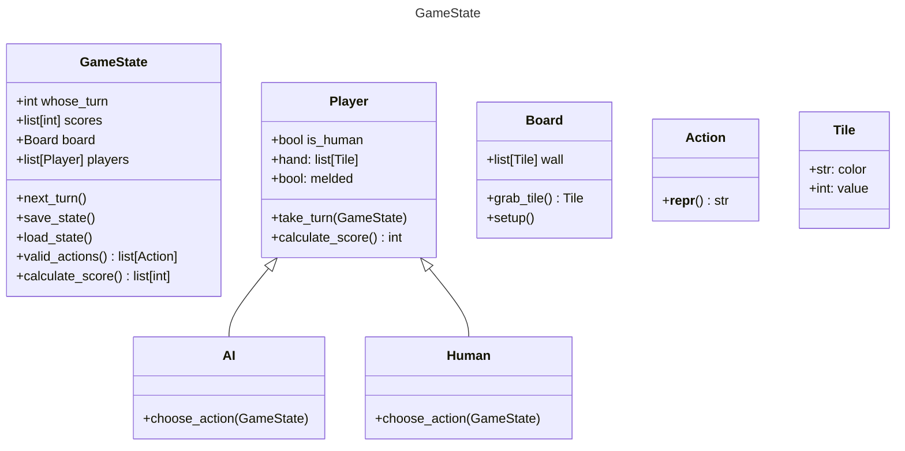

Player:
1. Current hand, which is a list of tiles?
2. FirstMeld or not
3.

board:
1. Wall
2. createWall or shuffleTiles
3.

Tiles:
1. Tile Number & Color
2. getScore()

GameState
1. CalculateWinner
   1. Sum getScore for each player
2. Whose turn it is
3. Turn order
4.

